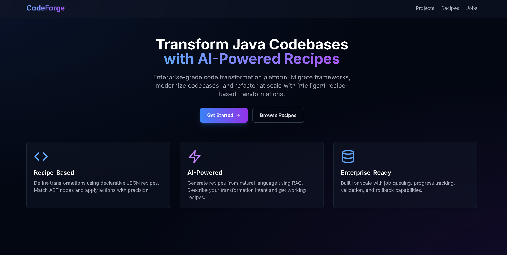

# Generic Recipe-Based Java Parser Transformer

A production-ready AST transformation engine for automated Java code migration and modernization. Transform entire codebases using declarative JSON recipes with full type resolution and validation.

[](https://openjdk.org/)
[](https://spring.io/)
[](https://nextjs.org/)
[](LICENSE)

## Overview

This platform enables large-scale Java code transformations through a custom recipe-based DSL. Built on JavaParser with full symbol resolution, it provides type-aware matching and precise AST manipulation for framework migrations, version upgrades, and code modernization.

The system consists of a transformation engine, REST API for job orchestration, modern web interface for project management, and AI-powered recipe generation via RAG.

**Use Cases**: Java EE to Spring Boot migrations, Java 8 to 17 upgrades, large-scale refactoring, code standardization across repositories.

## Features

**Transformation Engine**
- 37 built-in transformation actions covering annotations, types, methods, control flow, and code structure
- 30+ match criteria with full symbol resolution (FQN matching, inheritance chains, type inference)
- Transaction context with granular per-recipe rollback capability
- Validation framework with 5 validators for transformation correctness
- Extensible architecture via Java SPI for custom actions

**Platform Capabilities**
- RESTful API with async job execution and progress tracking
- Modern web interface with real-time updates and job monitoring
- Side-by-side diff viewer for code review
- Enhanced log visualization with color-coded transformation events
- AI-powered recipe generation from natural language using RAG
- Storage abstraction supporting local filesystem and S3-compatible storage (MinIO)
- Database support for H2 (development) and PostgreSQL (production)

## Architecture

The platform uses a multi-tier architecture:

```
Frontend Layer (Next.js 14 + TypeScript)
├── Project Management UI
├── Recipe Selection Interface
├── Job Execution Dashboard
└── Diff & Log Viewers

API Layer (Spring Boot 3.2)
├── REST Controllers (9 endpoints)
├── Job Orchestration Service
├── Async Job Execution with Semaphore Queue
├── Storage Service (Local/MinIO)
└── Recipe Discovery Service

Engine Layer (Java 21 + JavaParser)
├── Pipeline Orchestration
├── Node Matcher (30+ criteria)
├── Action Library (37 actions)
├── Transaction Context
├── Validation Framework
└── Symbol Resolver Integration

Supporting Services
├── Custom Actions (SPI-based extensibility)
└── RAG Service (OpenAI GPT-4 recipe generation)
```

**Core Technologies**: Java 21, Spring Boot 3.2, JPA/Hibernate, Next.js 14, TypeScript, Tailwind CSS, JavaParser 3.27, PostgreSQL/H2, OpenAI GPT-4

## Recipe Format

Recipes are defined in declarative JSON with match criteria and transformation actions:

```json
{
  "recipes": [
    {
      "name": "JaxRsToSpringMvc",
      "description": "Convert JAX-RS REST endpoints to Spring MVC controllers",
      "imports": {
        "add": ["org.springframework.web.bind.annotation.RestController"],
        "remove": ["javax.ws.rs.Path"]
      },
      "steps": [
        {
          "match": {
            "nodeType": "ClassOrInterfaceDeclaration",
            "annotation": "Path"
          },
          "actions": [
            {
              "migrateAnnotation": {
                "from": "Path",
                "to": "RequestMapping",
                "attributeMap": {
                  "value": "value"
                }
              }
            },
            {
              "addAnnotation": {
                "name": "RestController"
              }
            }
          ]
        },
        {
          "match": {
            "nodeType": "MethodDeclaration",
            "annotation": "GET"
          },
          "actions": [
            {
              "migrateAnnotation": {
                "from": "GET",
                "to": "GetMapping"
              }
            }
          ]
        }
      ]
    }
  ]
}
```

### Match Criteria

The matcher supports 30+ criteria for precise node selection:

**Type-Based Matching**: `nodeType`, `fqn`, `type`, `typeAny`, `typePattern`, `fqnScope`  
**Method Matching**: `methodName`, `declaringFqn`, `declaringFqnPattern`, `overridesFqn`, `overridesFqnPattern`, `paramCount`, `argumentCount`, `returnTypePattern`  
**Annotation Matching**: `annotation`, `annotationValuePattern`  
**Structural Matching**: `parentNodeType`, `requiresImport`, `forbidsImport`, `hasModifier`  
**Pattern Matching**: `matchExpr`, `scopePattern`, `namePattern`, `literalPattern`  
**Position-Based**: `beforeLine`, `afterLine`  
**Loop-Specific**: `initVarPattern`, `conditionPattern`, `updatePattern`, `accessPattern`

Full documentation in [`docs/matches.yml`](docs/matches.yml)

### Available Actions

37 transformation actions across six categories:

**Type Transformations**: `changeType`, `changeMethodReturnType`, `updateImplements`, `instanceOfToPattern`, `replacePackage`, `replaceStringFormatWithFormatted`

**Annotation Management**: `addAnnotation`, `removeAnnotation`, `migrateAnnotation`, `updateAnnotationAttribute`, `addAnnotationToParentClass`

**Method & Variable Operations**: `renameMethod`, `renameMethodCall`, `renameVariable`, `renameClass`

**Code Modernization**: `forToForEach`, `switchToReturnExpression`, `collapseLiteralConcat`, `replaceWithMethodCall`

**Import Management**: `addImport`, `removeImport`

**Modifier Operations**: `addModifier`, `removeModifier`, `setAccessLevel`, `clearInitializer`

**Node Manipulation**: `insertBefore`, `insertAfter`, `removeNode`, `removeParentNode`, `removeStatements`, `replaceWithTemplate`, `replaceWithScope`, `wrapWithTryCatch`, `removeParameter`, `removeArgument`, `wrapArgument`, `removeExceptionFromCatch`, `changeMethodTargetToStatic`, `addComment`, `removeComment`

Full documentation in [`docs/actions.yml`](docs/actions.yml)

## Installation

### Prerequisites

- Java Development Kit 21 or higher
- Apache Maven 3.8 or higher
- Node.js 18 or higher with npm
- (Optional) PostgreSQL 14+ for production deployment
- (Optional) OpenAI API key for AI recipe generation

### Build and Run

```bash
# Clone the repository
git clone <repository-url>
cd Generic-Recipe-Based-Java-Parser-Transformer

# Build all modules
mvn clean install -DskipTests

# Start the API server
cd api
mvn spring-boot:run

# In a new terminal, start the frontend
cd web
npm install
npm run dev
```

The API will be available at `http://localhost:8080` and the web interface at `http://localhost:3000`.

### Command-Line Usage

For standalone engine usage without the web interface:

```bash
# Build the shaded JAR
cd engine
mvn clean package

# Run from engine directory (config and resources are resolved from project root)
java -cp "target/engine-1.0-SNAPSHOT-shaded.jar" gst.Main resources/input/NetworkManagement

# Or run from project root
cd ..
java -cp "engine/target/engine-1.0-SNAPSHOT-shaded.jar" gst.Main resources/input/NetworkManagement
```

**Paths:** The input path is **relative to the project root** (the directory containing `config.json`). Use e.g. `resources/input/NetworkManagement`. The engine finds `config.json` in the current directory or its parent, so you can run from either `engine/` or the project root.

Configure recipes in `config.json` at the project root:
```json
[
  "jaxrs-to-spring-mvc",
  "cdi-to-spring-injection",
  "ejb-to-spring-beans"
]
```

## Usage

### Web Interface Workflow

1. **Create Project**: Upload a Java project as a ZIP file or point to a directory
2. **Select Recipes**: Browse the recipe library and select one or more transformation recipes
3. **Execute Job**: Start a transformation job and monitor progress in real-time
4. **Review Results**: Examine side-by-side diffs and detailed execution logs
5. **Download Output**: Download the transformed codebase

### Creating Custom Recipes

Place recipe JSON files in the `resources/` directory. The system automatically discovers and loads them.

Example recipe structure:

```json
{
  "recipes": [
    {
      "name": "ConvertDateToLocalDateTime",
      "description": "Replace java.util.Date with java.time.LocalDateTime",
      "steps": [
        {
          "match": {
            "nodeType": "ObjectCreationExpr",
            "fqn": "java.util.Date"
          },
          "actions": [
            {
              "replaceWithMethodCall": {
                "scope": "LocalDateTime",
                "method": "now"
              }
            },
            {
              "addImport": {
                "name": "java.time.LocalDateTime"
              }
            }
          ]
        },
        {
          "match": {
            "nodeType": "Parameter",
            "type": "java.util.Date"
          },
          "actions": [
            {
              "changeType": {
                "newType": "LocalDateTime"
              }
            }
          ]
        }
      ]
    }
  ]
}
```

### Available Production Recipes

The platform includes 16 production-ready recipes:

**Java EE to Spring Boot Migrations**
- `jaxrs-to-spring-mvc` - JAX-RS annotations to Spring MVC
- `cdi-to-spring-injection` - CDI dependency injection to Spring
- `ejb-to-spring-beans` - EJB components to Spring beans
- `jsf-beans-to-spring-components` - JSF managed beans to Spring components
- `producer-to-configuration` - CDI producers to Spring configuration
- `lifecycle-and-logging` - Java EE lifecycle to Spring
- `jax-spring-annotation-mappings` - Comprehensive JAX-RS migration (4 recipes)

**Java Version Upgrades**
- `11-17-mappings` - Java 8-11 to 17 with type compatibility validation
- `11-17-v2-mappings` - Pattern matching migration with validation
- `17-specific-mappings` - Java 17 specific features with override validation
- `17-specific-v2-mappings` - Additional Java 17 transformations

**Code Modernization**
- `mappingsV3` - Utility transformations (debug removal, deprecation, health checks)
- `sample-app-mappings` - Application-specific transformations
- `method-target-to-static-test` - Instance to static method conversion

## Technical Implementation

### Engine Architecture

The transformation engine is built around a pipeline that processes Java files through multiple stages:

1. **Parse**: Load Java files using JavaParser with symbol solver configured for full classpath resolution
2. **Match**: Find candidate nodes and evaluate match criteria using type information
3. **Transform**: Apply actions sequentially with change tracking in transaction context
4. **Validate**: Run validation rules if specified, rollback recipe on failure
5. **Write**: Output transformed files or copy unchanged files

**Key Classes**:
- `Pipeline.java` - Main orchestration logic with progress tracking
- `NodeMatcher.java` - Type-aware node matching with 30+ criteria (~700 LOC)
- `ActionFactory.java` - Factory for creating action instances with error handling
- `TxContext.java` - Transaction context for rollback and change tracking
- `ValidationFactory.java` - Validator registry and instantiation

### Symbol Resolution

The engine integrates JavaParser's SymbolSolver for type-aware transformations:

```java
CombinedTypeSolver typeSolver = new CombinedTypeSolver(
    new ReflectionTypeSolver(),
    new JavaParserTypeSolver(inputRoot),
    new JarTypeSolver(dependencyJar)  // Analyze dependencies
);
JavaSymbolSolver symbolSolver = new JavaSymbolSolver(typeSolver);
```

This enables:
- Fully qualified name resolution for types and methods
- Method declaring type resolution across inheritance hierarchies
- Type parameter and generic inference
- Override and interface implementation detection

### Transaction Context and Rollback

The transaction context tracks transformations at multiple granularities:

```java
public class TxContext {
    // Per-recipe change tracking
    private final Map<String, List<Node>> recipeChanges;
    private final Map<String, Map<Node, Node>> recipeOriginalNodes;
    
    // File-level tracking
    private final Set<Path> successfullyTransformedFiles;
    private final Map<Path, Set<String>> fileToRecipes;
    
    public void rollbackRecipe(String recipeName) {
        // Restores original AST nodes for specific recipe
    }
}
```

Rollback is triggered automatically when validation fails, preserving changes from other recipes.

### Action Implementation

Actions implement a simple interface but handle complex transformations:

```java
public interface Action {
    void apply(Node node, CompilationUnit cu, TxContext context, JavaSymbolSolver solver);
}
```

Example implementation (simplified):

```java
public class ChangeTypeAction implements Action {
    private final String newType;
    
    public void apply(Node node, CompilationUnit cu, TxContext ctx, JavaSymbolSolver solver) {
        if (node instanceof VariableDeclarationExpr vde) {
            vde.getVariables().forEach(v -> {
                v.setType(StaticJavaParser.parseType(newType));
                ctx.registerVarType(v.getNameAsString(), newType);
            });
        } else if (node instanceof Parameter prm) {
            prm.setType(StaticJavaParser.parseType(newType));
            ctx.registerVarType(prm.getNameAsString(), newType);
        }
        // ... handles MethodDeclaration, FieldDeclaration, ObjectCreationExpr
    }
}
```

### API Architecture

The Spring Boot API provides job orchestration with async execution:

**Job Execution Flow**:
1. Client submits job with project ID and recipe names
2. `JobExecutionService` acquires execution lock (semaphore-based queue)
3. Loads project files from storage
4. Calls `EnhancedPipelineService` with Recipe objects
5. Pipeline executes transformations with progress callbacks
6. Results stored in database and filesystem
7. Diff generated for code review
8. Lock released for next job

**Concurrency Control**: Jobs execute sequentially via semaphore to prevent resource conflicts. Additional jobs enter PENDING state and execute when lock is available.

### Frontend Implementation

Next.js 14 application with TypeScript providing:
- Project upload and management
- Recipe browsing with automatic discovery from filesystem
- Job creation and real-time status monitoring (3-second polling)
- Interactive diff viewer with line-by-line comparison
- Enhanced log viewer with parsed events and statistics
- Responsive design with Tailwind CSS

**Custom Components**:
- `DiffViewer` - Syntax-highlighted diff rendering with expand/collapse
- `LogViewer` - Parses and visualizes transformation logs with color coding
- Real-time job status updates with automatic refresh

## Configuration

### API Configuration

Edit `api/src/main/resources/application.yml`:

```yaml
spring:
  datasource:
    url: jdbc:h2:mem:recipe_db  # H2 for development
    # url: jdbc:postgresql://localhost:5432/recipe_db  # PostgreSQL for production
  
  jpa:
    hibernate:
      ddl-auto: update

storage:
  type: local  # Options: local, minio
  local:
    base-path: ./storage

recipes:
  resources-path: ../resources

openai:
  api-key: ${OPENAI_API_KEY:}
  model: gpt-4
```

### Frontend Configuration

Create `web/.env.local`:

```env
NEXT_PUBLIC_API_URL=http://localhost:8080
```

## Project Structure

```
.
├── engine/                       # Core transformation engine
│   ├── src/main/java/gst/
│   │   ├── api/                  # Recipe data model and deserialization
│   │   ├── engine/
│   │   │   ├── actions/          # 37 transformation action implementations
│   │   │   ├── matcher/          # Node matching with symbol resolution
│   │   │   ├── validator/        # 5 validation rules
│   │   │   ├── utils/            # AST utilities
│   │   │   ├── Pipeline.java     # Main orchestration
│   │   │   └── TxContext.java    # Transaction context
│   │   └── Main.java             # CLI entry point
│   └── pom.xml
│
├── api/                          # Spring Boot REST API
│   ├── src/main/java/com/recipe/api/
│   │   ├── controllers/          # REST endpoints
│   │   ├── services/             # Business logic
│   │   │   ├── engine/           # Pipeline integration
│   │   │   ├── storage/          # Storage abstraction
│   │   │   ├── JobExecutionService.java
│   │   │   └── RecipeDiscoveryService.java
│   │   ├── models/               # JPA entities
│   │   ├── repositories/         # Data access
│   │   └── dtos/                 # Data transfer objects
│   └── src/main/resources/
│       ├── application.yml
│       └── db/migration/         # Flyway migrations
│
├── web/                          # Next.js frontend
│   ├── app/                      # App router pages
│   │   ├── projects/            # Project management
│   │   ├── jobs/                # Job monitoring
│   │   └── recipes/             # Recipe library
│   ├── components/              # React components
│   │   ├── DiffViewer.tsx
│   │   ├── LogViewer.tsx
│   │   └── Navbar.tsx
│   └── lib/
│       └── api.ts               # API client
│
├── custom-actions/              # SPI-based custom actions
│   └── src/main/java/com/example/
│       ├── actions/             # Action implementations
│       └── providers/           # SPI providers
│
├── rag-service/                 # AI recipe generation
│   └── src/main/java/com/recipe/rag/
│       ├── generation/          # Recipe generation
│       └── documentation/       # Doc embedding
│
├── resources/                   # Recipe library
│   ├── jaxrs-to-spring-mvc.json
│   ├── cdi-to-spring-injection.json
│   └── ... (16 total recipes)
│
├── docs/                        # API documentation
│   ├── matches.yml              # Match criteria reference
│   ├── actions.yml              # Action reference
│   ├── validators.yml           # Validator reference
│   └── nodeTypes.yml            # Supported node types
│
└── pom.xml                      # Parent POM
```

## Development

### Building the Project

```bash
# Build all modules
mvn clean install

# Build specific module
mvn clean install -pl engine

# Skip tests
mvn clean install -DskipTests
```

### Running Tests

```bash
mvn test
```

### Adding Custom Actions

Implement the `ActionProvider` SPI:

```java
package com.example.providers;

import gst.engine.actions.Action;
import gst.engine.actions.spi.ActionProvider;

public class MyActionProvider implements ActionProvider {
    @Override
    public String getActionName() {
        return "myCustomAction";
    }
    
    @Override
    public Action create(Map<String, String> params) {
        return new MyCustomActionImpl(params);
    }
}
```

Register in `META-INF/services/gst.engine.actions.spi.ActionProvider`:
```
com.example.providers.MyActionProvider
```

See `custom-actions/` module for complete examples.

## Transformation Examples

### Example 1: JAX-RS to Spring MVC

**Input**:
```java
@Path("/users")
@Stateless
public class UserResource {
    @EJB
    private UserService userService;
    
    @GET
    @Produces(MediaType.APPLICATION_JSON)
    public Response getAllUsers() {
        List<User> users = userService.findAll();
        return Response.ok(users).build();
    }
    
    @POST
    @Consumes(MediaType.APPLICATION_JSON)
    public Response createUser(User user) {
        userService.create(user);
        return Response.status(201).build();
    }
}
```

**Output** (after applying `jaxrs-to-spring-mvc` and `ejb-to-spring-beans`):
```java
@RestController
@RequestMapping("/users")
public class UserResource {
    @Autowired
    private UserService userService;
    
    @GetMapping(produces = MediaType.APPLICATION_JSON)
    public ResponseEntity getAllUsers() {
        List<User> users = userService.findAll();
        return ResponseEntity.ok(users);
    }
    
    @PostMapping(consumes = MediaType.APPLICATION_JSON)
    public ResponseEntity createUser(@RequestBody User user) {
        userService.create(user);
        return ResponseEntity.status(201).build();
    }
}
```

All annotations, imports, types, and method signatures transformed automatically.

### Example 2: Java 8 to 17 Modernization

**Input**:
```java
for (int i = 0; i < users.size(); i++) {
    User user = users.get(i);
    System.out.println(user.getName());
}

if (obj instanceof String) {
    String str = (String) obj;
    return str.toUpperCase();
}
```

**Output**:
```java
for (User user : users) {
    System.out.println(user.getName());
}

if (obj instanceof String str) {
    return str.toUpperCase();
}
```

Uses `forToForEach` and `instanceOfToPattern` actions.

## Database

The platform uses JPA with support for multiple databases:

**Development**: H2 in-memory database (default, no setup required)
- URL: `jdbc:h2:mem:recipe_db`
- Console available at `http://localhost:8080/h2-console`
- User: `sa`, Password: (empty)

**Production**: PostgreSQL (recommended)
- Configure in `application-prod.yml`
- Flyway migrations automatically applied

**Schema**:
- `recipes` - User-created or AI-generated recipes
- `transformation_jobs` - Job execution history and status
- `projects` - Uploaded Java projects
- `users` - User accounts

## API Reference

### Key Endpoints

**Recipe Management**:
- `GET /api/recipes/discovery` - List all available recipes
- `GET /api/recipes/discovery/{name}` - Get specific recipe
- `GET /api/recipes/discovery/{name}/content` - Get recipe JSON
- `POST /api/recipes` - Create custom recipe
- `POST /api/recipes/generate` - AI-generate recipe from natural language

**Project Management**:
- `GET /api/projects` - List all projects
- `POST /api/projects` - Create project
- `POST /api/projects/{id}/upload` - Upload source code

**Job Execution**:
- `POST /api/jobs` - Create transformation job
- `GET /api/jobs/{id}` - Get job status and results
- `GET /api/jobs/{id}/diffs/{recipe}` - Get diff for specific recipe
- `GET /api/jobs/{id}/output/logs/{recipe}` - Get execution log

Full API documentation available via Swagger UI at `http://localhost:8080/swagger-ui.html` (when enabled).

## Validation and Rollback

### Validation Framework

Recipes can specify a validator for automatic rollback on errors:

```json
{
  "name": "SafeTypeChange",
  "rollbackOnError": "TypeCompatibilityRule",
  "steps": [...]
}
```

**Available Validators**:
- `TypeCompatibilityRule` - Ensures type changes maintain compatibility
- `SwitchExpressionCompletenessRule` - Validates switch expression completeness
- `OverrideRule` - Validates override annotations
- `PatternVariableUsageRule` - Validates pattern variable usage in instanceof
- `EnhancedForUsageRule` - Validates enhanced for loop conversions

### Rollback Behavior

If validation fails:
1. All changes from the failing recipe are automatically rolled back
2. Changes from other recipes are preserved
3. Error details logged for review
4. Original file state restored for rolled-back recipe

This granular rollback ensures partial progress is retained when one recipe in a chain fails.

## Performance

Tested on real-world codebases:

**Java Petstore EE7** (68 classes, 102 files)
- Transformation time: ~3 seconds
- All EE to Spring migrations successful

**Google Guava** (611 classes)
- Parse and analysis: ~15 seconds
- Selective transformations successful

**Enterprise Applications** (500+ classes)
- Full migration pipelines: ~30-60 seconds
- Production-grade performance with parallel file processing

## Extensibility

### Custom Actions via SPI

The platform uses Java's ServiceLoader mechanism for custom actions:

1. Implement `ActionProvider` interface
2. Register in `META-INF/services/gst.engine.actions.spi.ActionProvider`
3. Package as JAR and add to classpath

Custom actions are automatically discovered and available in recipes alongside built-in actions.

### Storage Backends

Storage is abstracted via the `StorageService` interface:
- `LocalFileStorageService` - Local filesystem (development)
- `MinioStorageService` - S3-compatible storage (production)

Implement `StorageService` to add new backends (Azure Blob, Google Cloud Storage, etc.)

## Testing

### Engine Testing

```bash
cd engine
mvn test

# Test with sample input
java -cp "target/engine-1.0-SNAPSHOT-shaded.jar" \
  gst.Main resources/input/sample-app
```

Output will be in `output/` directory with detailed logs.

### Integration Testing

The `resources/input/` directory contains test projects:
- `sample-app` - Simple test application
- `Java-application-petstore-ee7` - Real-world Java EE application
- `NetworkManagement` - JAX-RS REST API

Run recipes against these to verify transformations.

## Documentation

Comprehensive documentation in YAML format:

- [`docs/matches.yml`](docs/matches.yml) - Complete reference for all 30+ match criteria with examples
- [`docs/actions.yml`](docs/actions.yml) - Documentation for all 37 actions with usage patterns
- [`docs/validators.yml`](docs/validators.yml) - Validation rule specifications
- [`docs/nodeTypes.yml`](docs/nodeTypes.yml) - Supported AST node types (23 types)

Additional documentation:
- [`SETUP.md`](SETUP.md) - Detailed setup and configuration guide
- [`ARCHITECTURE_OVERVIEW.md`](ARCHITECTURE_OVERVIEW.md) - Deep dive into system architecture
- [`QUICK_START.md`](QUICK_START.md) - Fast-track getting started guide

## Advanced Features

### AI-Powered Recipe Generation

Generate recipes from natural language using RAG:

```bash
POST /api/recipes/generate
{
  "intent": "Convert all JAX-RS @Path annotations to Spring @RequestMapping and add @RestController to classes"
}
```

The RAG service:
1. Embeds the intent using OpenAI embeddings
2. Retrieves relevant documentation (actions, matches, examples) via vector similarity
3. Uses GPT-4 to synthesize a complete recipe
4. Validates the generated JSON structure

### Progress Tracking

Real-time progress via callback interface:

```java
public interface TransformationProgressCallback {
    void onFileStart(String fileName, int current, int total);
    void onFileComplete(String fileName, boolean transformed);
    void onError(String fileName, String error);
    void onComplete(int totalFiles, int filesTransformed, int filesFailed);
}
```

### Diff Generation

The `DiffService` generates detailed diffs:
- Line-by-line comparison with context
- Addition/deletion counts per file
- Categorization (CONTEXT, DELETED, INSERTED)
- Efficient storage as JSON

## Production Deployment

### Database Setup

For production, use PostgreSQL:

```bash
# Create database
createdb recipe_db

# Configure in application-prod.yml
spring:
  datasource:
    url: jdbc:postgresql://localhost:5432/recipe_db
    username: recipe_user
    password: ${DB_PASSWORD}
  
  jpa:
    hibernate:
      ddl-auto: validate  # Use Flyway migrations
```

### Storage Setup

For production, use MinIO or S3:

```yaml
storage:
  type: minio
  minio:
    endpoint: https://minio.yourcompany.com
    access-key: ${MINIO_ACCESS_KEY}
    secret-key: ${MINIO_SECRET_KEY}
    bucket: recipe-transformer
```

### Environment Variables

```bash
export DB_PASSWORD=your_db_password
export MINIO_ACCESS_KEY=your_access_key
export MINIO_SECRET_KEY=your_secret_key
export OPENAI_API_KEY=your_openai_key  # Optional, for AI features
```

## License

[Add your license here]

## Contributing

Contributions are welcome. Please ensure:
- Code follows existing patterns and style
- New actions include comprehensive edge-case handling
- Documentation updated for new features
- Tests pass before submitting PR

## Acknowledgments

Built with:
- [JavaParser](https://javaparser.org/) - Java AST parsing and manipulation
- [Spring Boot](https://spring.io/projects/spring-boot) - Application framework
- [Next.js](https://nextjs.org/) - React framework
- [Tailwind CSS](https://tailwindcss.com/) - Styling framework

---

## Adding Images to README

To add screenshots or diagrams:

**Option 1: Store in repo**
```markdown

```

Then place image at `docs/images/architecture.png`

**Option 2: Use external hosting (GitHub, Imgur)**
```markdown

```

**Option 3: Use relative paths**
```markdown
<!-- For images in root -->


<!-- For images in docs -->

```

**Best Practice**: Create `docs/images/` directory and store screenshots there. Keep images under 1MB for fast loading.

---

**This platform demonstrates end-to-end software engineering across the full stack with emphasis on clean architecture, type safety, and production-ready implementation.**
